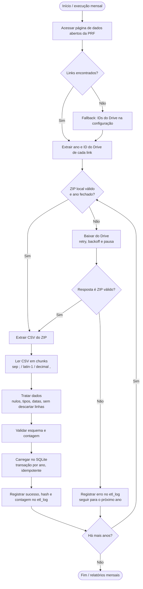

# Relatório: Automatização do ETL – Dados Abertos da PRF (Brasil, todas as BRs e UFs)

Data: 2026-09-19

## 1. Resumo

- **A automatização é viável e permitida.** A PRF publica os dados como *dados abertos* ("sem restrição de licenças, patentes ou mecanismos de controle"). O `robots.txt` de gov.br não bloqueia `/prf`.
- **O ponto frágil não é o gov.br, é o Google Drive.** Os CSVs ficam em links do Drive, e não há API oficial. O crawler deve tratar o Drive com cuidado (limites de cota, página de confirmação de vírus).
- **Recomendação:** Python + `requests` + `BeautifulSoup` (descoberta de links) → `pandas` ou `polars` (transformação) → SQLite. Agendar com cron ou systemd timer, uma vez por mês.

## 2. O site permite automação?

| Item | Achado |
|---|---|
| Licença/termos | A página declara dados abertos, legíveis por máquina e sem restrição de controle. O conteúdo do portal usa CC BY-ND 3.0. **Cite a fonte (PRF)**. A cláusula ND vale para o conteúdo do portal. Para os dados, o cuidado é não atribuir à PRF dados alterados. |
| robots.txt (gov.br) | Nenhuma regra para `/prf`. Os bloqueios são de formulários e de `/ebserh`, `/mre`, `/economia`. Rastrear a página é permitido. |
| API | Não existe. Só há download direto de arquivos. |
| Frequência de atualização | Mensal (acidentes e multas). Não faz sentido rodar com mais frequência. |
| Hospedagem dos arquivos | Google Drive (`drive.google.com/file/d/<ID>/view`). |
| Contato | cccom@prf.gov.br, para dados que não estejam no site. |

**Ressalva sobre o Drive.** O download programático é tecnicamente possível: `https://drive.google.com/uc?export=download&id=<ID>` responde com redirecionamento 303 para `drive.usercontent.google.com/download?...` (testado hoje). Os Termos do Google restringem acesso automatizado abusivo. Arquivos grandes podem exigir um token de confirmação, e o Drive pode limitar as cotas de download. Com 10 arquivos por mês, o volume é baixo. Mesmo assim:

- use um User-Agent identificável, pausas entre downloads e no máximo 1 conexão simultânea;
- faça cache: só baixe de novo o arquivo do **ano corrente**, porque os anos fechados não mudam;
- se o Drive bloquear, o plano B é o download manual. O README já prevê essa alternativa.

### 2.1 Risco de bloqueio ao baixar os 10 arquivos (2017–2026)

O volume total é de cerca de 110 MB em 10 arquivos de 8 a 13 MB. É pequeno para o Drive, e um bloqueio permanente é improvável. O Drive não publica limites numéricos, então isto é uma avaliação, não uma garantia.

**O que pode acontecer**
- **Cota de download excedida.** É contada por arquivo, somando todos os usuários, e não depende do seu IP. Dura cerca de 24 h.
- **Página de confirmação de vírus.** É rara com arquivos deste tamanho. Trate o caso mesmo assim.
- **HTTP 429 ou CAPTCHA.** Ocorre com muitas requisições seguidas ou com IPs suspeitos (VPN, datacenter, CI na nuvem).

**Execução local (IP residencial).** Este é o melhor cenário, pois o Drive desconfia menos desses IPs. Restam dois pontos:
- a cota por arquivo continua valendo, mesmo em IP local;
- rodar o ETL várias vezes seguidas durante testes pode gerar 429. O cache evita isso.

**Mitigações**
1. Uma conexão por vez, pausa de 3 a 5 s entre arquivos e User-Agent identificável.
2. Retry com backoff para 429 e 5xx. Falhar com mensagem clara se a resposta vier como `text/html` em vez de ZIP.
3. Cache: se o ZIP já existe e passa em `zipfile.testzip()`, não baixar de novo. Anos fechados são baixados uma única vez.
4. Arquivos independentes: se um falhar por cota, registrar no `etl_log` e tentar na próxima execução, sem refazer os demais.
5. Fallback manual: o modo `--skip-download` processa os ZIPs locais. Os 10 já estão na pasta do projeto.
6. Se a cota estourar: esperar até 24 h ou baixar pelo navegador. Não insistir em loop.

**Não recomendado:** rotação de IPs, proxies ou disfarce de navegador para contornar limites. Isso viola os termos do Google e não é necessário para este volume.

## 3. Observações sobre os dados (verificadas nos ZIPs locais)

- Cada ZIP contém 1 CSV. O de 2026 tem cerca de 135 MB descompactado e cerca de 353 mil linhas.
- CSV com `;` como separador, campos entre aspas e **decimais com vírgula** (`km`, `latitude` e `longitude`, como em `-27,08476806`).
- Encoding provável: latin-1 ou cp1252. Valide por arquivo, pois os anos antigos podem diferir.
- 37 colunas, com o mesmo cabeçalho em 2017 e 2026: `id;pesid;data_inversa;dia_semana;horario;uf;br;km;municipio;causa_principal;causa_acidente;ordem_tipo_acidente;tipo_acidente;classificacao_acidente;fase_dia;sentido_via;condicao_metereologica;tipo_pista;tracado_via;uso_solo;id_veiculo;tipo_veiculo;marca;ano_fabricacao_veiculo;tipo_envolvido;estado_fisico;idade;sexo;ilesos;feridos_leves;feridos_graves;mortos;latitude;longitude;regional;delegacia;uop`.
- **Granularidade: 1 linha por pessoa/veículo/causa, não por acidente.** O mesmo `id` se repete (por exemplo `742885`, com causas diferentes). O README pede uma tabela `acidentes` com o "histórico de acidentes". Decida antes:
  - (a) manter a granularidade original com chave `(id, pesid, id_veiculo, causa_acidente, ordem_tipo_acidente)`; ou
  - (b) criar também uma visão ou tabela agregada por `id`, para contagens de acidentes.
  - Sem isso, contagens ficam infladas.
- **Não haverá filtro por `uf` nem `br`**: todas as linhas dos 10 arquivos são carregadas (cerca de 350 mil linhas só em 2026, ~135 MB de CSV). Leia em blocos (chunks), sem carregar o arquivo inteiro. Filtros por rodovia ou estado ficam para as consultas e relatórios. Crie índices em `uf` e `br`.
- A grafia do dicionário (`condicao_metereologica`) deve ser mantida como está no original.
- Valores ausentes: o CSV usa strings como `(null)` ou `NA` em alguns anos. Normalize para `NULL`, sem descartar linhas (requisito do README).
- `km` e `br` podem vir como texto em anos antigos. Converta com `pd.to_numeric(errors="coerce")`, guardando o valor bruto se a conversão falhar.

## 4. Melhor conjunto de ferramentas

### Extração (crawler)
| Necessidade | Escolha | Motivo |
|---|---|---|
| HTTP | `requests` (ou `httpx`) + `urllib3.Retry` | Simples, com retry e backoff, timeouts e `raise_for_status`. |
| Parse HTML | `beautifulsoup4` + `lxml` | A página é HTML estático do Plone. Playwright/Selenium seriam exagero. |
| Extração do ID do Drive | regex `/file/d/([\w-]+)` | Os links do README têm o sufixo estranho `?usp=sharing/download`. Extrair o ID é mais robusto que usar a URL. |
| Download do Drive | `requests` direto em `uc?export=download&id=`, tratando a página de confirmação. `gdown` é alternativa. | `gdown` já resolve o token de confirmação, mas é mais uma dependência. |
| Identificação do ano | regex do texto do link ("Acidentes 2026") | Não dependa da ordem dos links. |

Validação de erros (exigida no README):
- timeout e retry (3 a 5 tentativas com backoff exponencial);
- verificar `Content-Type`: se vier `text/html` em vez de ZIP, o Drive devolveu uma página de erro ou de cota;
- `zipfile.is_zipfile()` e `testzip()` antes de processar;
- log por arquivo (sucesso, falha, tamanho, SHA-256).

### Transformação
- **`polars` ou `pandas` com `chunksize`.** Para ~10 arquivos e algumas centenas de MB, `pandas` já basta e é mais familiar. `polars` é 5 a 10 vezes mais rápido e usa menos memória, se o volume crescer.
- Leitura: `sep=";"`, `encoding="latin-1"`, `decimal=","`, `dtype=str` na primeira leitura, e conversão explícita depois.
- Validação de esquema: `pandera` (opcional) ou um dicionário de tipos próprio, derivado do PDF do dicionário.

### Armazenamento
- **SQLite** (pedido no README) é adequado: um único arquivo, sem servidor, milhões de linhas sem problema.
- Configurar `PRAGMA journal_mode=WAL`, criar índices em `(data_inversa)`, `(uf, br, km)`, `(municipio)`, `(id)`.
- Usar `sqlite3` da biblioteca padrão ou `SQLAlchemy Core`. `pandas.to_sql` serve para cargas simples, mas o *upsert* é melhor com `INSERT ... ON CONFLICT`.
- Alternativa analítica: **DuckDB** lê CSV direto (`read_csv`), é mais rápido para agregações e exporta para SQLite/Parquet. Só vale se as análises ficarem pesadas. Mantenha o SQLite como entregável.
- Guardar os brutos em `data/raw/` (ZIPs) e, opcionalmente, Parquet em `data/processed/`.

### Orquestração
| Opção | Quando usar |
|---|---|
| **cron / systemd timer** (recomendado) | Um job mensal simples. O Fedora já tem systemd. |
| GitHub Actions agendado | Se quiser rodar na nuvem e sem máquina ligada. Note que IPs de datacenter podem ser bloqueados pelo Drive. |
| Airflow / Prefect / Dagster | Exagero para 1 job por mês. Só se o projeto crescer para várias fontes. |

## 5. Arquitetura proposta

```
etl-prf-data/
├── src/prf_etl/
│   ├── crawler.py      # acessa a página, extrai links (ano → ID do Drive)
│   ├── download.py     # download com retry, validação de ZIP, cache/hash
│   ├── transform.py    # leitura em chunks, tipagem, nulos
│   ├── load.py         # DDL, upsert idempotente no SQLite
│   └── main.py         # CLI: --years 2017-2026 --force --skip-download
├── data/raw/  data/db/prf.sqlite
├── tests/
└── pyproject.toml
```

Fluxo por arquivo: **descobrir link → baixar (se novo/alterado) → validar ZIP → extrair CSV → ler em chunks → tratar → carregar → registrar em tabela `etl_log`**.



Pontos importantes:
1. **Idempotência.** Reexecutar não pode duplicar linhas. Para o ano corrente, faça `DELETE WHERE ano = X` e recarregue dentro de uma transação. Como o arquivo é reescrito todo mês, isso é mais simples que um upsert.
2. **Detecção de mudança.** Compare o SHA-256 ou o tamanho do ZIP com o da última carga (`etl_log`).
3. **Transação por arquivo.** Se um ano falhar, os outros seguem e o erro fica registrado.
4. **Fallback.** Se o crawler não achar os links (a página mudou), use uma lista de IDs em arquivo de configuração (o README já os lista). Os ZIPs já estão na pasta. O modo `--skip-download` processa esses arquivos locais.
5. **Alertas.** Se a contagem de linhas de um ano cair em relação à carga anterior, ou o esquema mudar, o job falha com log claro.

## 6. Riscos

| Risco | Mitigação |
|---|---|
| Drive limita a cota ou bloqueia | Cache, ritmo baixo, fallback manual, apenas o ano corrente é baixado. |
| A página muda o HTML | Seletor tolerante (procurar todos os `<a href*="drive.google.com">`) + fallback de IDs em config. |
| Esquema ou encoding mudam entre anos | Validar o cabeçalho e falhar com mensagem clara. |
| Contagem inflada (várias linhas por acidente) | Decidir o modelo (ver seção 3). |
| Dados pessoais (`pesid`, idade, sexo) | São anonimizados pela PRF, mas trate o banco como interno e não o republique com alterações atribuídas à PRF. |
| Python 3.14 (versão da máquina) | Confirme wheels para `pandas`/`polars`/`lxml` antes de fixar a versão. Use `uv` para gerenciar o ambiente. |

## 7. Próximos passos sugeridos

1. Decidir o modelo da tabela `acidentes` (por linha original ou também agregada por `id`).
2. Implementar `crawler.py` + `download.py` com testes contra o HTML salvo da página.
3. Implementar `transform.py` e `load.py` usando os ZIPs que já estão na pasta.
4. Adicionar CLI, `etl_log` e o timer mensal.
5. Opcional: relatórios mensais (o README cita "relatórios mensais") via SQL/`pandas` a partir do SQLite.

## Fontes
- Página de dados abertos da PRF: https://www.gov.br/prf/pt-br/acesso-a-informacao/dados-abertos/dados-abertos-da-prf
- robots.txt do gov.br: https://www.gov.br/robots.txt
- Teste de redirecionamento do Drive e inspeção dos ZIPs locais, feitos em 2026-09-19.
